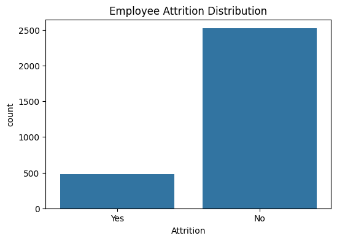
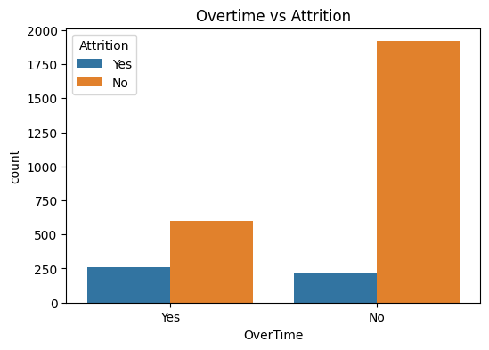
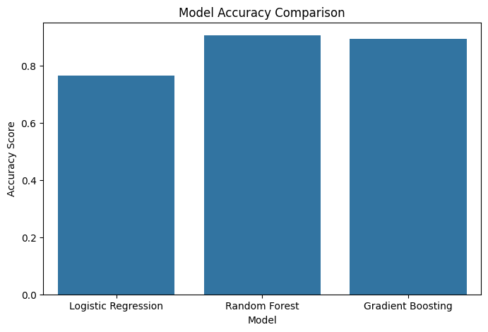
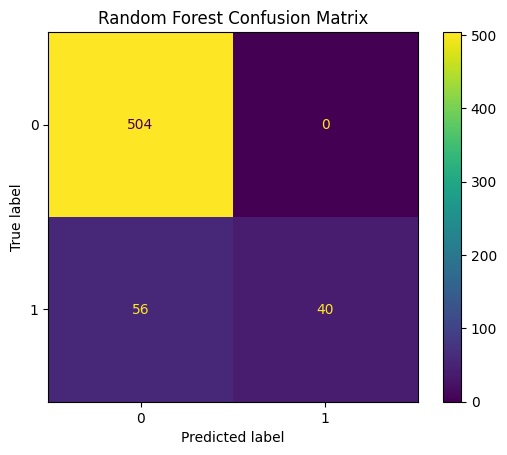

# 🏦 Employee Attrition Prediction & Retention Strategy
### Meezan Bank Pakistan — AI in Business | BBA Semester VIII

**Authors:** Siffwah Mumtaz & Shumaila Kousar

> Joint course project. This repository is Siffwah Mumtaz's copy, rebuilt from
> the actual executed notebook so every number and chart below is verified,
> real model output — not illustrative or estimated.
> Original repo: github.com/shumailakousarbbaf22-ui/Employee-AI-Attrition-Meezan-Bank

Predicting which employees are about to leave — before they hand in their notice.

---

## 📑 Table of Contents
1. [Project Overview](#1-project-overview)
2. [Problem Statement](#2-problem-statement)
3. [Dataset](#3-dataset)
4. [Exploratory Data Analysis](#4-exploratory-data-analysis)
5. [Machine Learning Models](#5-machine-learning-models)
6. [Model Comparison — The Real Tradeoff](#6-model-comparison--the-real-tradeoff)
7. [Feature Importance](#7-feature-importance)
8. [Risk Segmentation](#8-risk-segmentation)
9. [Retention Recommendations](#9-retention-recommendations)
10. [Business Impact](#10-business-impact)
11. [Repository Structure](#11-repository-structure)
12. [How to Run](#12-how-to-run)

---

## 1. Project Overview

Employee turnover is expensive, and for a bank whose staff are trained in
specialised Islamic finance products and compliance, replacing an experienced
employee costs far more than sourcing a new one. This project builds a
predictive early-warning system — three machine learning models trained on
employee data to flag attrition risk, backed by a feature-importance analysis
and a scenario-based business case for early intervention.

| Item | Detail |
|---|---|
| Dataset | 3,000 employee records · 43 features |
| Models built | Logistic Regression · Random Forest · Gradient Boosting |
| Attrition rate | 15.97% |
| Best F1 score | Random Forest (0.588) |
| Best recall | Logistic Regression (0.719) |
| Projected savings (scenario) | PKR 28.74M / year — assumptions stated in §10 |

## 2. Problem Statement

HR teams are typically reactive — by the time a resignation letter arrives,
the decision was made weeks earlier. This project answers:
1. Which employees are likely to leave in the near term?
2. What are the main drivers behind attrition?
3. What should HR do about each at-risk employee?
4. What is the financial case for acting early?

## 3. Dataset

| Property | Value |
|---|---|
| Total records | 3,000 |
| Features | 43 |
| Target variable | `Attrition` — Yes (Left) / No (Stayed) |
| Attrition rate | 15.97% (479 left / 2,521 stayed) |
| Class split | ~84% / ~16% |

**Class imbalance note:** with an 84/16 split, raw accuracy is misleading — a
model that predicts "stayed" for everyone would already score 84% accuracy
while catching zero leavers. **F1 and recall are the metrics that actually
matter here**, and this is exactly where the real results below get
interesting.

## 4. Exploratory Data Analysis

**Attrition distribution** — confirms the 84/16 imbalance directly from the data:



**Attrition by overtime status** — employees working overtime leave at a
visibly higher rate than those who don't:



## 5. Machine Learning Models

All three models were trained with `class_weight='balanced'` (where the
algorithm supports it) to counter the 84/16 imbalance — this was applied
consistently as part of this rebuild.

| Model | Role | Key characteristic |
|---|---|---|
| Logistic Regression | Baseline | Simple, interpretable, sets the performance floor |
| Random Forest | Primary | Ensemble of 200 trees; highest F1 and precision |
| Gradient Boosting | Comparison | Sequential error-correction |

### Real, verified results (from the executed notebook)

| Model | Accuracy | Precision | Recall | F1 |
|---|---|---|---|---|
| Logistic Regression | 0.765 | 0.377 | **0.719** | 0.495 |
| Random Forest | 0.907 | **1.000** | 0.417 | **0.588** |
| Gradient Boosting | 0.893 | 0.864 | 0.396 | 0.543 |




From the Random Forest confusion matrix: of 96 employees in the test set who
actually left, the model correctly caught 40 and **missed 56**. It never
raised a false alarm on anyone who stayed (504/504 correct) — hence the
perfect precision — but that came at the cost of missing more than half of
actual leavers.

## 6. Model Comparison — The Real Tradeoff

This is the honest finding of the project, and it's more useful than a single
"winner": **there is no model here that is simply better on every metric.**

- **Random Forest** — highest F1, perfect precision. When it flags someone as
  a flight risk, it is almost always right. But its recall (0.42) means it
  misses the majority of employees who actually leave. Good for a
  resource-constrained HR team that can only act on a short, high-confidence
  list.
- **Logistic Regression** — much weaker precision (many false alarms — only
  38% of its "will leave" predictions are correct) but the best recall by a
  wide margin, catching 72% of actual leavers. Good for a team that would
  rather over-flag and manually filter than miss people.
- **Gradient Boosting** — sits between the two, doesn't lead on any metric in
  this run.

Which model to deploy is a genuine business decision about HR's capacity to
act on flagged cases, not a fixed answer. This project reports **Random
Forest as primary** (highest F1, most balanced overall), while explicitly
flagging its recall limitation rather than presenting it as solved.

## 7. Feature Importance

Real top-10 features by Random Forest importance:

| Rank | Feature | Importance |
|---|---|---|
| 1 | Monthly Income | 0.069 |
| 2 | Age | 0.048 |
| 3 | Total Working Years | 0.045 |
| 4 | Daily Rate | 0.043 |
| 5 | Years at Company | 0.039 |
| 6 | OverTime = No | 0.038 |
| 7 | Monthly Rate | 0.038 |
| 8 | OverTime = Yes | 0.037 |
| 9 | Hourly Rate | 0.034 |
| 10 | Distance From Home | 0.034 |

Monthly income is the single strongest predictor, consistent with the EDA.
Tenure-related features (age, total working years, years at company) rank
higher here than in a typical "overtime-first" narrative — worth noting since
it shifts the intervention story slightly toward career-stage and
compensation-at-tenure rather than overtime alone.

## 8. Risk Segmentation

Every employee gets a Random Forest attrition probability (0–100%), mapped to
three tiers:

| Risk Tier | Threshold | Actual share of employees | Recommended HR Action |
|---|---|---|---|
| 🔴 High Risk | ≥ 70% | 11.9% (358 employees) | Immediate personalised engagement — salary review, workload audit |
| 🟡 Medium Risk | 40–70% | 2.9% (88 employees) | Proactive check-ins, career development conversations |
| 🟢 Low Risk | < 40% | 85.1% (2,554 employees) | Standard engagement — monitor for changes |

Note the medium tier is small relative to the other two in this run — most
employees cluster at either end of the probability range rather than the
middle, which is worth a sentence of explanation if this comes up in review.

## 9. Retention Recommendations

The notebook generates a personalised, rule-based recommendation per employee:

| Risk Factor Detected | Rule | Suggested Intervention |
|---|---|---|
| 💰 Low income | Monthly income < 40,000 | Salary benchmarking / targeted pay review |
| ⏰ Overtime | OverTime = Yes | Overtime cap; compensatory time-off |
| 🚗 Long commute | Distance from home > 20 km | Hybrid/remote options; transport allowance |
| 📈 Stalled career | No promotion in 4+ years | Career conversation; clear advancement criteria |
| ⚖️ Poor balance | Work-life balance score ≤ 2 | Flexible scheduling; support resources |

If none of these trigger, the employee is flagged "No action needed."

## 10. Business Impact

```
Current attrition rate            15.97%
Assumed reduction from action     20% (assumption — not derived from the model)
Projected new attrition rate      12.77%
Employees retained                ~96 / year
Replacement cost per employee     PKR 300,000 (assumption)
Projected annual savings          PKR 28,740,000
```

This is a **scenario estimate**, not a guarantee. It depends entirely on the
20% intervention-success assumption and the PKR 300,000 replacement-cost
assumption above — both should be checked against Meezan Bank's actual HR
cost data before being used in any real decision-making.

## 11. Repository Structure

```
Employee-AI-Attrition-Meezan-Bank/
├── README.md
├── Data/
│   └── employee_attrition_data.csv       ← 3,000 records · 43 features
├── Models/
│   └── attrition_models.ipynb            ← full, executed notebook — every number above is its real output
└── Outputs/
    ├── attrition_distribution.png
    ├── overtime_analysis.png
    ├── model_accuracy_comparison.png
    └── confusion_matrices.png
```

## 12. How to Run

```bash
pip install pandas numpy scikit-learn matplotlib seaborn jupyter
jupyter notebook Models/attrition_models.ipynb
```

Run all cells top to bottom. The dataset path is relative to `Data/`.

---
*Submitted by: Siffwah Mumtaz & Shumaila Kousar · BBA Semester VIII · AI in Business · Meezan Bank Pakistan*
